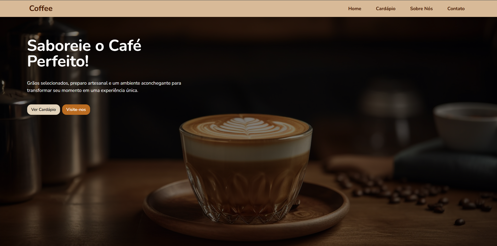
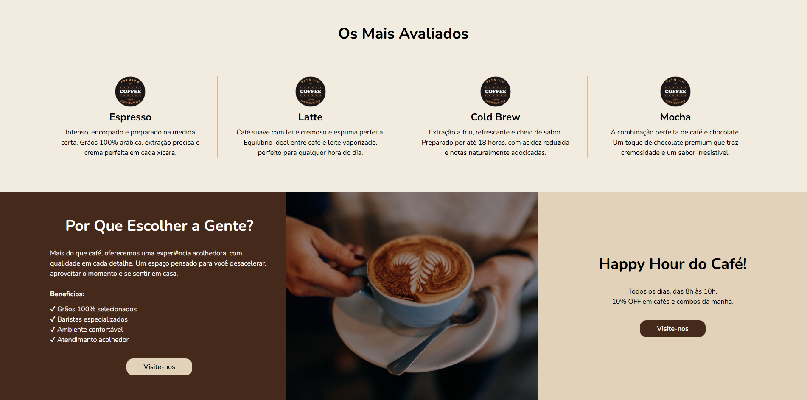
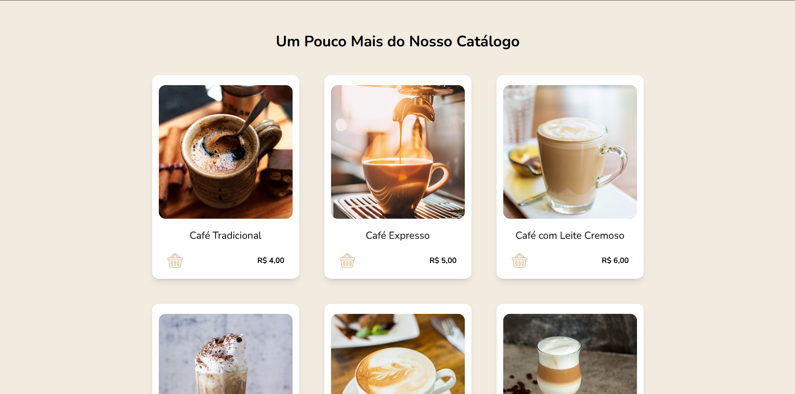
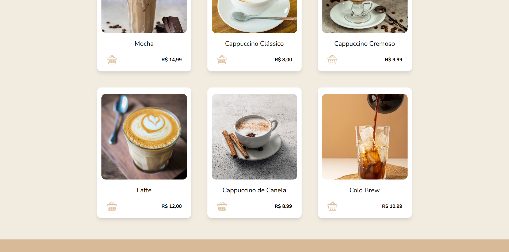
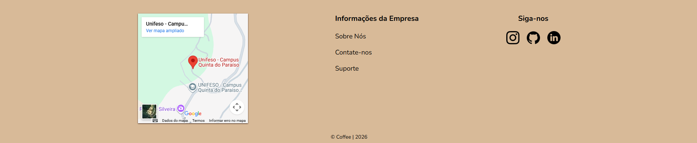

# ☕ Coffee

Projeto de uma **cafeteria fictícia** desenvolvido com o objetivo de **praticar conceitos de Front-end**, principalmente **React** e **Tailwind CSS**.

## 🎯 Objetivo do Projeto

Este projeto não possui fins comerciais. Ele foi criado apenas para:

- Praticar **React**
- Utilizar **Tailwind CSS** para estilização
- Treinar organização de componentes
- Explorar boas práticas de Front-end

## 🚀 Tecnologias Utilizadas

- **React**
- **Tailwind CSS**
- **JavaScript**
- **HTML5**
- **CSS3**

## 📸 Preview

<p align="center">
  
  
  
  
  
</p>


## 📂 Funcionalidades

- Interface moderna e responsiva
- Layout inspirado em uma cafeteria
- Componentização com React
- Estilização utilizando Tailwind CSS

## 🛠️ Como executar o projeto

```bash
# Clone o repositório
git clone https://github.com/JuniorWSoares/coffee.git

# Entre na pasta do projeto
cd coffee

# Instale as dependências
npm install

# Execute o projeto
npm run dev
